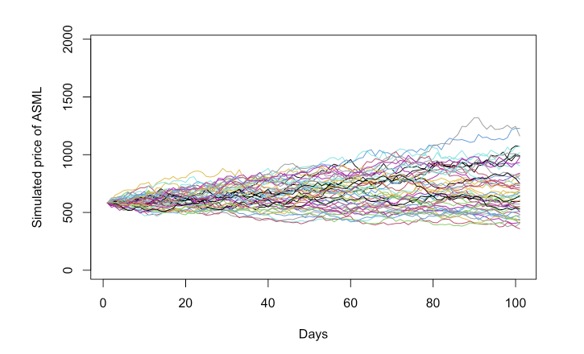

## [Project3: Monte Carlo Simulations](https://github.com/dsrichard97/montecarlo_analysis.git)
* Collaborators: Richard Diazdeleon, Nate Talampas
* Date: October 3rd, 2023

## Research Questions
* I.   What is the expected stock price trajectory for NVDA and ASML over a specified time horizon?
* II.  How do the risk profiles of NVDA and ASML compare, as measured by metrics such as Value at Risk (VaR) and Conditional Value at Risk (CVaR)?
* III. Can Monte Carlo simulations provide actionable insights for portfolio diversification involving NVDA and ASML stocks?

## Methodology
* Data Exploration:
  * a. Fetch historical stock data for NVDA and ASML (Yahoo Finance Historical Data).
  * b. Perform exploratory data analysis to understand trends, seasonality, and volatility.
* Statistical Tests:Conduct unit root tests to check for stationarity and use Granger causality tests to explore potential leading indicators. 
* Model Fitting:
  * a. Calibrate Monte Carlo simulations using historical data and relevant financial metrics.
  * b. Utilize Geometric Brownian Motion (GBM) for stock price simulations.
* Model Comparison: We can create compute simulated trajectories of NVDA and ASML. This would allow us to evaluate the models based on risk and return metrics.
## Key Findings

##  Python Code and Libraries Used
* Python Version: 3.9
* Libraries: yfinance, numpy, matplotlib, scipy, pandas

## Future Work
For future work it would be intresting to try the following below approach where this report explores differentiable programming in conjunction with Monte Carlo methods, showcasing applications such as fast search of phase transitions and accurately finding ground states of interacting many-body models in two dimensions​. For more information check out Shi-Xin Zhang, Zhou-Quan Wan, and Hong Yao, published on July 21, 2023. [ Automatic differentiable Monte Carlo: Theory and application](https://journals.aps.org/prresearch/references/10.1103/PhysRevResearch.5.033041)

## References
PowerPoint:

Tableau: 

Workflow: 

Dataset:  https://finance.yahoo.com/quote/ASML/history?p=ASML
https://finance.yahoo.com/quote/NVDA?p=NVDA&.tsrc=fin-srch

Other References: 

